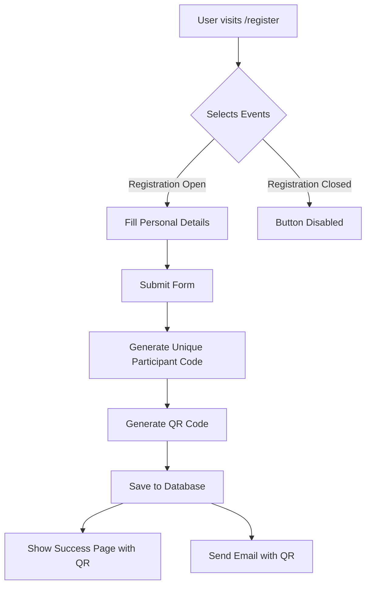
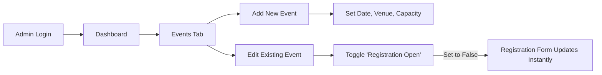
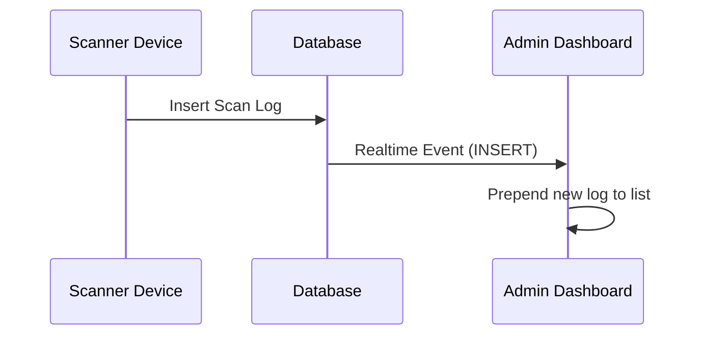

# Attendix Application Workflow

This document outlines the core workflows of the Attendix system, covering the Participant, Admin, and Event Staff journeys.

## 1. Registration Process (Public)
**Actors**: Students/Participants
**Goal**: Register for events and obtain a QR code.



**Key Features**:
- **Event Validation**: Users cannot register for closed events.
- **Duplicate Check**: Prevents selecting the same event multiple times.
- **Real-time Feedback**: Immediate QR code generation.

---

## 2. Event Management (Admin)
**Actors**: Administrators
**Goal**: Manage event details and control registration access.



**Key Features**:
- **Registration Control**: Open/Close registrations with a toggle.
- **Capacity Tracking**: Monitor current vs. max capacity.

---

## 3. Event Day Operations (Staff/Scanner)
**Actors**: Gate Volunteers, Event Managers
**Goal**: Verify participants and track attendance.

```mermaid
graph TD
    A[Staff Login] --> B[Select Role]
    B -->|Gate Volunteer| C[Gate Entry Scanner]
    B -->|Event Manager| D[Event Attendance Scanner]
    
    C --> E{Scan QR Code}
    D --> E
    
    E --> F{Validate Participant}
    F -->|Valid| G[Mark Status: Success]
    F -->|Already Scanned| H[Mark Status: Duplicate Warning]
    F -->|Not Registered| I[Mark Status: Error]
    
    G --> J[Log to 'scan_logs']
    J --> K[Update Admin Dashboard (Real-time)]
    J --> L[Increment Event Attendance Count]
```

**Key Features**:
- **Real-time Logs**: Admin dashboard updates instantly when a scan occurs (`supabase_realtime`).
- **Validation Logic**: Checks if the participant is registered for the specific event being scanned.
- **Flow Control**: Gate entry is recorded separately from specific event attendance.

---

## 4. Real-time Monitoring (Admin)
**Actors**: Administrators
**Goal**: Monitor ongoing event activity.

1.  **View Logs**: The "Logs" tab shows a live feed of all successful and failed scans.
2.  **Live Stats**: Event cards show real-time attendance progress bars.


